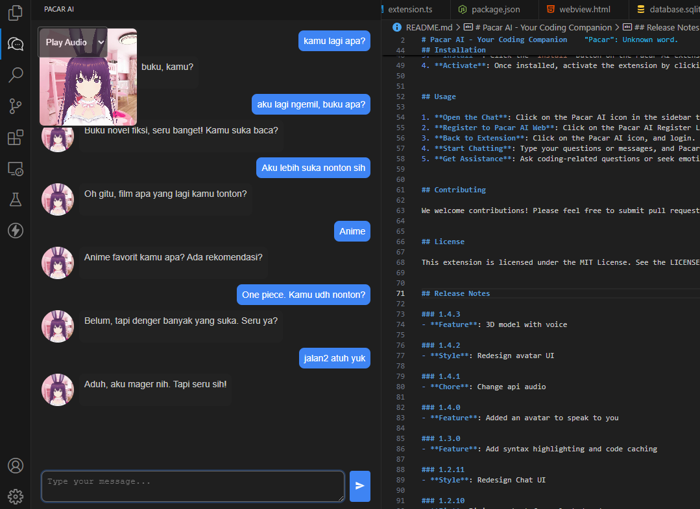
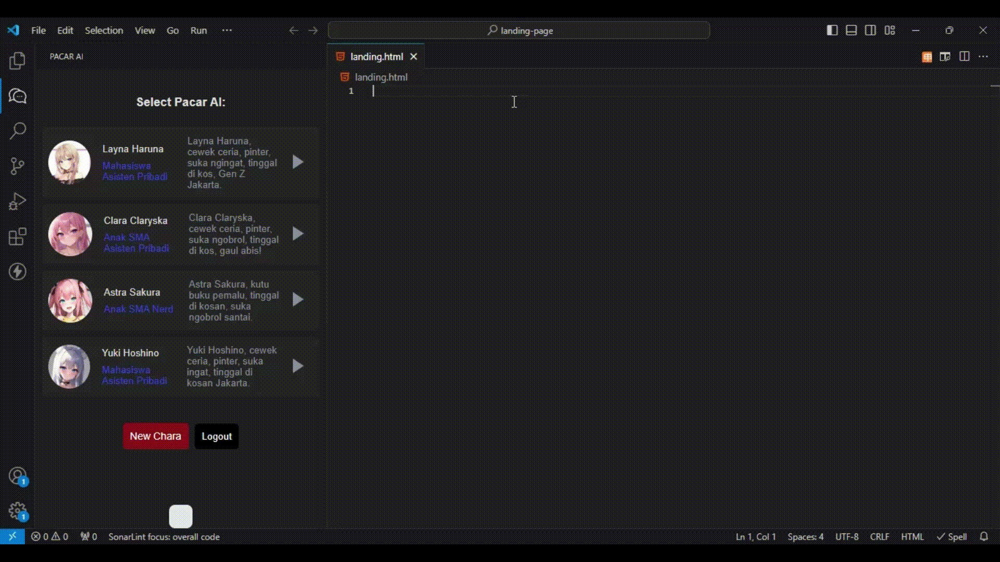

markdown
# Pacar AI - Your Coding Companion

Pacar AI is a chat extension with an assistant designed to help you while programming. You can roleplay with this assistant, making your coding sessions more enjoyable and interactive.

Imagine having an AI Girlfriend who not only assists you with coding but also keeps you company during those long programming marathons. She can provide emotional support, share a laugh, and even offer smart insights to help you solve complex problems. With Pacar AI, you're never coding alone.

Ready to code with a twist of companionship? 🌟💻💕

 <!-- Menambahkan ss pertama -->
 <!-- Menambahkan image pertama -->
 <!-- Menambahkan image kedua -->
        

## Features 

**Programming Assistance**  
Get help with coding problems, syntax errors, and best practices. 

**Roleplay with AI**  
Enjoy conversations with your AI companion, making coding less lonely and more engaging. 

**3D Model with Voice**  
Interactive 3D avatar responds with speech.

**Interactive Chat**  
Communicate with Pacar AI in real-time. Ask questions and receive instant responses. 

**Emotional Support**  
Need a motivational boost? Pacar AI is here to lift your spirits!

**Select Code to AI**  
Easily select code snippets and ask Pacar AI for explanations, debugging help, or improvements directly.

**Continue the Code Based on the Provided Comment with Shift+Enter Key**  
Effortlessly extend your code by leveraging the AI's understanding of your comments to generate relevant and context-aware code snippets that follow your intended logic and requirements.
- Press Shift+Enter key after comment in your code

## Upcoming Features 

- **Code Completion**: Suggests code elements like variable and function names based on the current context. 

## Installation 

1. **Install the Extension**: Open Visual Studio Code, go to the Extensions view by clicking the Extensions icon in the Activity Bar on the side of the window, or select `View` -> `Extensions`. 
2. **Search for Pacar AI**: Type `Pacar AI` in the search box. 
3. **Install**: Click the `Install` button on the Pacar AI extension from the Marketplace. 
4. **Activate**: Once installed, activate the extension by clicking on the Pacar AI icon in the sidebar.

## Usage 

1. **Open the Chat**: Click on the Pacar AI icon in the sidebar to open the chat window. 
2. **Register to Pacar AI Web**: Click on the Pacar AI Register Link. 
3. **Back to Extension**: Click on the Pacar AI icon, and login. 
4. **Start Chatting**: Type your questions or messages, and Pacar AI will respond. 
5. **Get Assistance**: Ask coding-related questions or seek emotional support and motivation.

## Contributing 

We welcome contributions! Please feel free to submit pull requests or issues on our [GitHub repository](https://github.com/asepindrak/pacar-ai-extension). 

## License 

This extension is licensed under the MIT License. See the LICENSE file for details.

## Release Notes

### 1.4.5
- **Fix**: Remove welcome message

### 1.4.4
- **Chore**: Change label voice option

### 1.4.3
- **Feature**: 3D model with voice

### 1.4.2
- **Style**: Redesign avatar UI

### 1.4.1
- **Chore**: Change api audio

### 1.4.0
- **Feature**: Added an avatar to speak to you

### 1.3.0
- **Feature**: Add syntax highlighting and code caching

### 1.2.11
- **Style**: Redesign Chat UI

### 1.2.10
- **Fix**: Fixing context for selected code

### 1.2.9
- **Fix**: Change Code Accept to Popup Message
- **Feature**: Show loading while Pacar AI generate code

### 1.2.7
- **Fix**: Change Code Suggestion key to Shift+Enter key.

### 1.2.3
- **Style**: Redesign UI.

### 1.2.2
- **Chore**: Rename Extension.

### 1.2.1
- **Fix**: Change enter key to Ctrl+Enter key.
- **Fix**: Fix bug enter key.

### 1.2.0
- **Feature**: Continue the code based on the provided comment.
- **Feature**: Send message without editor.

### 1.1.1
- **Fix**: UI messages from user to handle code.

### 1.1.0
- **Feature**: Select Code to AI.

### 1.0.2
- **Style**: Enhanced UI with new styles and layout adjustments.

### 1.0.1
- **Style**: Redesigned login form UI.

### 1.0.0
- **Initial Release**: Pacar AI.

---